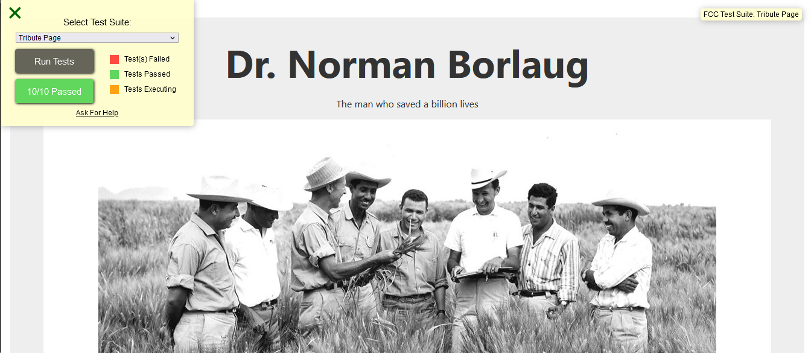
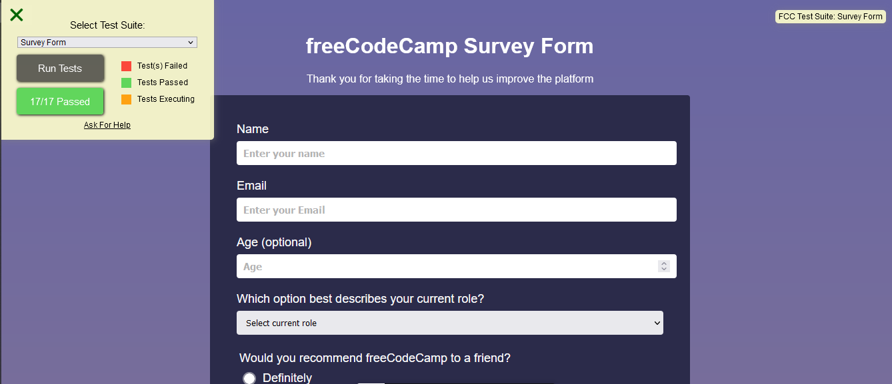
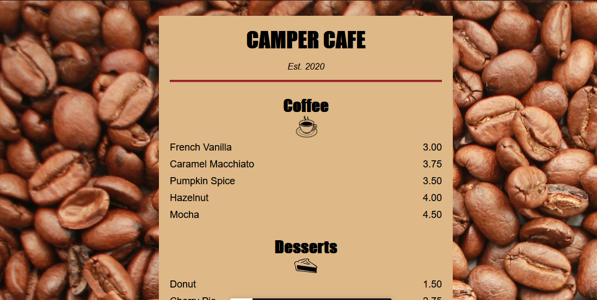
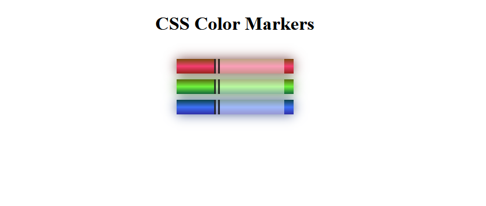

# codecamp-ResponsiveWebDesignProjects
working on web design projects based on ***user stories*** and get all of the tests to pass, to apply all of the skills, principles, and concepts I have learned so far,

**HTML, CSS, Visual Design, Accessibility, and more.**
## [Tribute page](tribute_page)

-*[CodePen Link](https://codepen.io/saraatq/pen/popEvaw?editors=1101)*-

## [Survey Form](Survey_Form)

-*[CodePen Link](https://codepen.io/saraatq/pen/JjMRZjx)*-

## pages without tests
### [Cafe Menu](cafe-menu)
-*[CodePen Link](https://codepen.io/saraatq/pen/qBoYyNy)*-

### [Colored Markers](colored-markers)
-*[CodePen Link](https://codepen.io/saraatq/pen/dymLOxg)*-

### [Registration Form](registration-form)
-*[CodePen Link](https://codepen.io/saraatq/pen/poVzYPm)*-

