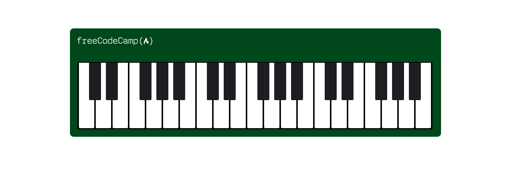

# codecamp-ResponsiveWebDesignProjects
working on web design projects based on ***user stories*** and get all of the tests to pass, to apply all of the skills, principles, and concepts I have learned so far,

**HTML, CSS, Visual Design, Accessibility, and more.**
## [Tribute page](tribute_page)

-*[CodePen Link](https://codepen.io/saraatq/pen/popEvaw?editors=1101)*-

## [Survey Form](Survey_Form)

-*[CodePen Link](https://codepen.io/saraatq/pen/JjMRZjx)*-

## [Technical Documentation Page](technical-documentation-page)

-*[CodePen Link](https://codepen.io/saraatq/pen/NWMNmVM)*-

## pages without tests
### [Cafe Menu](cafe-menu)
-*[CodePen Link](https://codepen.io/saraatq/pen/qBoYyNy)*-

### [Colored Markers](colored-markers)
-*[CodePen Link](https://codepen.io/saraatq/pen/dymLOxg)*-

### [Registration Form](registration-form)
-*[CodePen Link](https://codepen.io/saraatq/pen/poVzYPm)*-

### [Rothko Painting](rothko-painting)
-*[CodePen Link](https://codepen.io/saraatq/pen/GRdKaGN)*-

### [Photo Gallery](photo-gallery)
-*[CodePen Link](https://codepen.io/saraatq/pen/mdLbNbG)*-

### [Nutrition Facts](nutrition-facts)
-*[CodePen Link](https://codepen.io/saraatq/pen/OJZJOBw)*-

### [Accessibility Quiz Practice](accessibility-quiz-practice)
-*[CodePen Link](https://codepen.io/saraatq/pen/mdLVxVY)*-

### [Balance Sheet](balance-sheet)
-*[CodePen Link](https://codepen.io/saraatq/pen/NWMxJbx)*-

### [Picasso Painting](picasso-painting)
-*[CodePen Link](https://codepen.io/saraatq/pen/xxjVWBy)*-

### [Piano](piano)
-*[CodePen Link](https://codepen.io/saraatq/pen/yLjOwzg)*-

### [City Skyline](city-skyline)
-*[CodePen Link](https://codepen.io/saraatq/pen/qBYrBya)*-

***@media > 1000***

***@media <= 1000***

### [Magazine](magazine)
-*[CodePen Link](https://codepen.io/saraatq/pen/YzLQBpv)*-

